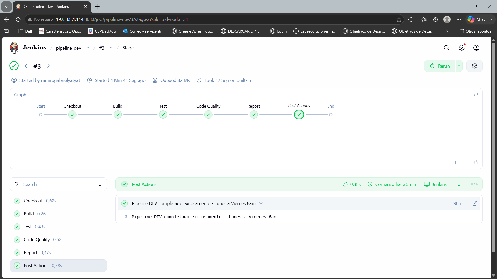
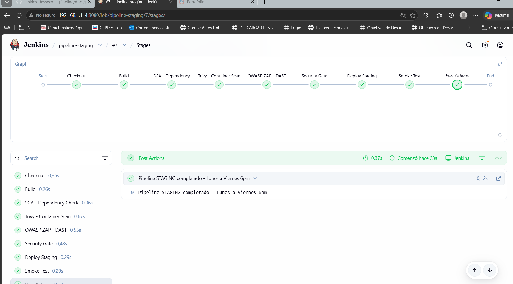

# Jenkins DevSecOps Pipeline

Infraestructura de integración continua construida con Jenkins Master en Docker sobre Ubuntu Server, con dos nodos esclavos conectados por SSH. Desarrollado como parte del curso de DevOps en la Universidad Mariano Gálvez de Guatemala.

---

## 🏗️ Arquitectura

- **Jenkins Master** corriendo en Docker dentro de Ubuntu Server (VirtualBox)
- **nodo-dev** — nodo esclavo conectado por SSH
- **nodo-staging** — nodo esclavo conectado por SSH
- **3 pipelines** configurados incluyendo pipeline de limpieza automática los viernes

---

## 🛠️ Tecnologías


---

## 📂 Estructura

jenkins-devsecops-pipeline/
├── pipelines/
│ ├── pipeline-dev.groovy
│ ├── pipeline-staging.groovy
│ └── pipeline-cleanup-friday.groovy
├── docs/
│ └── pipeline-diagram.md
├── screenshots/
└── docker-compose.yml

---

## 🚀 Cómo levantar el entorno

```bash
# Levantar Jenkins Master con Docker
docker-compose up -d

# Verificar que el contenedor esté corriendo
docker ps
```

---

## 🔒 Seguridad - Pipeline Staging

| Herramienta | Tipo                    | Propósito                                   |
| ----------- | ----------------------- | ------------------------------------------- |
| SCA         | Análisis de composición | Detecta vulnerabilidades en dependencias    |
| Trivy       | Escaneo de contenedores | Detecta CVEs en imágenes Docker             |
| OWASP ZAP   | DAST                    | Análisis dinámico de seguridad en endpoints |

### Security Gate

| Severidad | Límite     | Acción                         |
| --------- | ---------- | ------------------------------ |
| CRITICAL  | 0          | Pipeline falla automáticamente |
| HIGH      | 5          | Pipeline falla automáticamente |
| MEDIUM    | Sin límite | Solo advertencia               |

---

## 📸 Screenshots




---

## 🔗 Relacionado

Este proyecto se integra con el ecosistema DevSecOps:

| Repositorio                                                             | Relación                                                           |
| ----------------------------------------------------------------------- | ------------------------------------------------------------------ |
| [cypress-saucedemo](https://github.com/ryaty1-RM/cypress-saucedemo)     | Los tests E2E se ejecutan desde este pipeline                      |
| [tuleapp-qa-workflow](https://github.com/ryaty1-RM/tuleapp-qa-workflow) | Los tickets y casos de prueba están documentados en el board de QA |

---

## 🌿 Estrategia de Branches

Este repositorio utiliza **GitHub Flow**:

| Branch    | Propósito                              |
| --------- | -------------------------------------- |
| `main`    | Código estable y listo para producción |
| `develop` | Rama de desarrollo e integración       |

**Flujo de trabajo:**

1. Todo el desarrollo se hace en `develop`
2. Cuando el código está listo y probado, se hace merge a `main`
3. `main` siempre contiene código funcional
